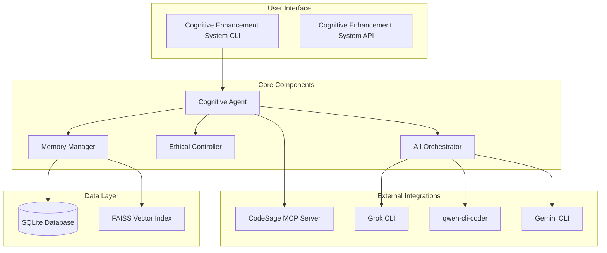

# CES Phase 0.3: Basic Integration Guide

## Overview

Phase 0.3 implements basic integration between all CES components, establishing end-to-end workflows from user input through AI assistant execution. This guide documents the integration patterns, data flows, and best practices established during this phase.

## Architecture Overview



## Integration Patterns

### 1. Task Execution Workflow

The primary integration pattern is the end-to-end task execution workflow:

```python
# Complete task execution flow
agent = CognitiveAgent(config)
result = agent.execute_task("Implement user authentication")

# Internal flow:
# 1. Task Analysis -> Complexity scoring, skill identification
# 2. Ethical Check -> Validate task acceptability
# 3. Context Retrieval -> Get relevant historical data
# 4. AI Assistant Selection -> Choose optimal assistant
# 5. Task Execution -> Delegate to AI assistant
# 6. Result Processing -> Store and format results
```

### 2. Component Communication Patterns

#### Synchronous Communication
- **Cognitive Agent ↔ Memory Manager**: Direct method calls for context storage/retrieval
- **Cognitive Agent ↔ Ethical Controller**: Synchronous validation checks
- **AI Orchestrator ↔ AI Assistants**: Direct CLI/API calls with timeout handling

#### Asynchronous Communication
- **CodeSage Integration**: Async HTTP requests to MCP server
- **Performance Monitoring**: Background metric collection
- **Health Checks**: Periodic async validation

### 3. Data Flow Patterns

#### Task Analysis Flow
```python
task_description -> CognitiveAgent.analyze_task() -> TaskAnalysis
    ↓
MemoryManager.analyze_context_needs() -> required_context_types
    ↓
MemoryManager.retrieve_context() -> relevant_context_data
    ↓
AIOrchestrator.recommend_assistants() -> assistant_preferences
```

#### Result Storage Flow
```python
execution_result -> MemoryManager.store_task_result()
    ↓
SQLite Database (task_history, user_preferences, context_data)
    ↓
FAISS Index (semantic memory for future retrieval)
```

## Component Integration Details

### Cognitive Agent Integration

**Responsibilities:**
- Task analysis and complexity assessment
- Orchestration of component interactions
- Result aggregation and presentation

**Integration Points:**
- **Memory Manager**: Context retrieval and storage
- **Ethical Controller**: Task validation
- **AI Orchestrator**: Assistant selection and execution
- **CodeSage**: Enhanced analysis capabilities

**Best Practices:**
```python
# Always validate task before execution
analysis = agent.analyze_task(task_description)
if analysis.ethical_concerns:
    if not ethical_controller.approve_task(analysis.ethical_concerns):
        return {"status": "rejected", "reason": "Ethical concerns"}

# Retrieve context for informed execution
context = memory_manager.retrieve_context(task_description, analysis.context_requirements)

# Execute with optimal assistant
result = ai_orchestrator.execute_task(task_description, context, analysis.recommended_assistants)

# Store results for learning
memory_manager.store_task_result(task_description, result)
```

### Memory Manager Integration

**Storage Strategy:**
- **Working Memory**: In-memory cache with SQLite persistence
- **Task History**: SQLite database with indexed retrieval
- **User Preferences**: Key-value storage with JSON serialization
- **Semantic Memory**: FAISS vector index for similarity search

**Integration Patterns:**
```python
# Context retrieval with fallback
context = memory_manager.retrieve_context(task, requirements)
if not context.get('task_history'):
    context['task_history'] = memory_manager._get_recent_tasks(limit=3)

# Efficient storage with error handling
try:
    memory_manager.store_task_result(task, result)
except Exception as e:
    logger.error(f"Failed to store task result: {e}")
    # Continue execution - don't fail the whole task
```

### AI Orchestrator Integration

**Assistant Selection Logic:**
1. Check user preferences first
2. Match task requirements to assistant capabilities
3. Verify assistant availability
4. Fallback to general-purpose assistants

**Error Handling:**
```python
try:
    result = await ai_orchestrator.execute_task(task, context, preferences)
    if result['status'] == 'failed':
        # Try fallback assistant
        fallback_result = await ai_orchestrator.execute_task(task, context, ['grok'])
        return fallback_result
except Exception as e:
    logger.error(f"AI execution failed: {e}")
    return {"status": "error", "error": str(e)}
```

### CodeSage Integration

**MCP Protocol Usage:**
```python
# Initialize connection
codesage = CodeSageIntegration()
connected = await codesage.connect()

if connected:
    # Execute tools
    result = await codesage.execute_tool("analyze_codebase", {"path": "/project"})
    # Process results
    analysis_data = result.get('result', {})
```

**Best Practices:**
- Always check connection status before tool execution
- Handle MCP protocol errors gracefully
- Cache tool discovery results
- Implement retry logic for transient failures

## Error Handling and Recovery

### Error Classification

1. **Transient Errors**: Network timeouts, temporary service unavailability
2. **Configuration Errors**: Missing API keys, invalid settings
3. **Data Errors**: Corruption, serialization failures
4. **System Errors**: Resource exhaustion, component failures

### Recovery Strategies

#### Circuit Breaker Pattern
```python
class CircuitBreaker:
    def __init__(self, failure_threshold=5, recovery_timeout=60):
        self.failure_count = 0
        self.last_failure_time = None
        self.state = 'closed'  # closed, open, half-open

    async def execute(self, func, *args, **kwargs):
        if self.state == 'open':
            if time.time() - self.last_failure_time > self.recovery_timeout:
                self.state = 'half-open'
            else:
                raise CircuitBreakerError("Circuit breaker is open")

        try:
            result = await func(*args, **kwargs)
            self._on_success()
            return result
        except Exception as e:
            self._on_failure()
            raise e

    def _on_success(self):
        self.failure_count = 0
        self.state = 'closed'

    def _on_failure(self):
        self.failure_count += 1
        self.last_failure_time = time.time()
        if self.failure_count >= self.failure_threshold:
            self.state = 'open'
```

#### Graceful Degradation
```python
async def execute_with_fallback(self, task, primary_assistant, fallback_assistants):
    """Execute task with fallback assistants"""
    assistants_to_try = [primary_assistant] + fallback_assistants

    for assistant in assistants_to_try:
        try:
            result = await self.ai_manager.execute_with_assistant(assistant, task)
            if result.success:
                return result
        except Exception as e:
            logger.warning(f"Assistant {assistant} failed: {e}")
            continue

    # All assistants failed
    return {"status": "failed", "error": "All assistants unavailable"}
```

## Performance Optimization

### Caching Strategies

#### Memory Caching
```python
from functools import lru_cache
import asyncio

class MemoryCache:
    def __init__(self, max_size=100, ttl_seconds=300):
        self.cache = {}
        self.max_size = max_size
        self.ttl = ttl_seconds

    async def get(self, key):
        if key in self.cache:
            entry = self.cache[key]
            if time.time() - entry['timestamp'] < self.ttl:
                return entry['value']
            else:
                del self.cache[key]
        return None

    async def set(self, key, value):
        if len(self.cache) >= self.max_size:
            # Remove oldest entry
            oldest_key = min(self.cache.keys(),
                           key=lambda k: self.cache[k]['timestamp'])
            del self.cache[oldest_key]

        self.cache[key] = {
            'value': value,
            'timestamp': time.time()
        }
```

#### Database Query Optimization
```python
# Use parameterized queries to prevent SQL injection and enable query plan caching
def store_task_result(self, task_description, result):
    with sqlite3.connect(self.db_path) as conn:
        cursor = conn.cursor()
        cursor.execute('''
            INSERT INTO task_history
            (task_description, result, complexity_score, execution_time, assistant_used)
            VALUES (?, ?, ?, ?, ?)
        ''', (
            task_description,
            json.dumps(result),
            result.get('analysis', {}).get('complexity_score', 0),
            result.get('analysis', {}).get('estimated_duration', 0),
            result.get('assistant_used', 'unknown')
        ))
        conn.commit()
```

### Connection Pooling

```python
import aiohttp

class ConnectionPool:
    def __init__(self, max_connections=10):
        self.max_connections = max_connections
        self.session = None

    async def get_session(self):
        if self.session is None or self.session.closed:
            self.session = aiohttp.ClientSession(
                connector=aiohttp.TCPConnector(limit=self.max_connections)
            )
        return self.session

    async def close(self):
        if self.session:
            await self.session.close()
```

## Testing Patterns

### Integration Test Structure

```python
class TestCESIntegration:
    @pytest.fixture
    async def setup_integration_test(self):
        """Setup for integration tests"""
        config = CESConfig()
        config.memory_db_path = tempfile.mktemp(suffix='.db')

        # Initialize components
        agent = CognitiveAgent(config)
        ai_manager = AIAssistantManager()

        yield agent, ai_manager

        # Cleanup
        if os.path.exists(config.memory_db_path):
            os.unlink(config.memory_db_path)

    @pytest.mark.asyncio
    async def test_complete_task_workflow(self, setup_integration_test):
        """Test complete end-to-end task execution"""
        agent, ai_manager = setup_integration_test

        task = "Create a simple function"
        result = await agent.execute_task(task)

        assert result['status'] == 'completed'
        assert 'result' in result
        assert 'timestamp' in result
```

### Mocking Strategy

```python
@pytest.fixture
def mock_ai_assistant(self):
    """Mock AI assistant for testing"""
    with patch('ces.ai_orchestrator.cli_integration.GrokCLIIntegration') as mock_grok:
        mock_instance = Mock()
        mock_instance.is_available.return_value = True
        mock_instance.execute_task = AsyncMock(return_value={
            "success": True,
            "response": "Mock response",
            "execution_time": 0.1
        })
        mock_grok.return_value = mock_instance
        yield mock_instance
```

## Monitoring and Observability

### Health Check Endpoints

```python
async def health_check(request):
    """Comprehensive health check endpoint"""
    health_status = {
        "service": "CES",
        "timestamp": datetime.now().isoformat(),
        "version": "0.3",
        "status": "healthy",
        "checks": {}
    }

    # Component health checks
    try:
        agent = request.app['cognitive_agent']
        agent_status = agent.get_status()
        health_status["checks"]["cognitive_agent"] = {
            "status": "healthy" if agent_status["status"] == "operational" else "unhealthy",
            "details": agent_status
        }
    except Exception as e:
        health_status["checks"]["cognitive_agent"] = {
            "status": "error",
            "error": str(e)
        }

    # Overall status
    all_healthy = all(
        check.get("status") == "healthy"
        for check in health_status["checks"].values()
    )
    health_status["status"] = "healthy" if all_healthy else "degraded"

    return web.json_response(health_status)
```

### Performance Metrics Collection

```python
class PerformanceMonitor:
    def __init__(self):
        self.metrics = {}

    def record_metric(self, name, value, tags=None):
        """Record a performance metric"""
        if name not in self.metrics:
            self.metrics[name] = []

        self.metrics[name].append({
            "value": value,
            "timestamp": time.time(),
            "tags": tags or {}
        })

    def get_percentiles(self, name, percentiles=[50, 95, 99]):
        """Calculate percentiles for a metric"""
        if name not in self.metrics:
            return {}

        values = [m["value"] for m in self.metrics[name]]
        values.sort()

        result = {}
        for p in percentiles:
            index = int(len(values) * p / 100)
            result[f"p{p}"] = values[min(index, len(values) - 1)]

        return result
```

## Deployment Considerations

### Environment Configuration

```bash
# Production environment variables
export CES_DEBUG_MODE=false
export CES_LOG_LEVEL=INFO
export CES_MAX_MEMORY_MB=512
export CES_CACHE_ENABLED=true

# AI Assistant API keys
export GROK_API_KEY="your-grok-key"
export GEMINI_API_KEY="your-gemini-key"
export QWEN_API_KEY="your-qwen-key"

# Database configuration
export CES_MEMORY_DB_PATH="/data/ces_memory.db"
export CES_MAX_CONTEXT_AGE_DAYS=90
```

### Docker Configuration

```dockerfile
FROM python:3.9-slim

# Install system dependencies
RUN apt-get update && apt-get install -y \
    sqlite3 \
    && rm -rf /var/lib/apt/lists/*

# Set working directory
WORKDIR /app

# Copy requirements and install
COPY requirements.txt .
RUN pip install --no-cache-dir -r requirements.txt

# Copy application code
COPY ces/ ./ces/
COPY scripts/ ./scripts/

# Create data directory
RUN mkdir -p /data

# Set environment variables
ENV CES_MEMORY_DB_PATH=/data/ces_memory.db
ENV PYTHONPATH=/app

# Expose port for monitoring
EXPOSE 9090

# Health check
HEALTHCHECK --interval=30s --timeout=10s --start-period=5s --retries=3 \
    CMD python -c "from ces.core.cognitive_agent import CognitiveAgent; CognitiveAgent().get_status()"

# Run the application
CMD ["python", "-m", "ces.cli.ces_cli"]
```

### Scaling Considerations

1. **Horizontal Scaling**: Multiple CES instances behind a load balancer
2. **Database Scaling**: Connection pooling and read replicas
3. **Cache Scaling**: Distributed caching with Redis
4. **AI Service Scaling**: API rate limiting and request queuing

## Best Practices Summary

### Code Organization
- Keep components loosely coupled through well-defined interfaces
- Use dependency injection for testability
- Implement proper error boundaries

### Performance
- Implement caching for expensive operations
- Use async/await for I/O operations
- Monitor and optimize database queries
- Implement connection pooling

### Reliability
- Implement circuit breakers for external services
- Use exponential backoff for retries
- Implement graceful degradation
- Log errors with sufficient context

### Security
- Validate all inputs
- Use parameterized queries
- Implement proper authentication
- Encrypt sensitive data

### Testing
- Write comprehensive unit tests
- Implement integration tests for component interactions
- Use property-based testing for complex logic
- Monitor test coverage

### Monitoring
- Implement structured logging
- Collect performance metrics
- Set up health checks
- Implement alerting for critical issues

This guide provides the foundation for CES Phase 0.3 integration. As the system evolves, these patterns should be refined and extended based on operational experience and user feedback.